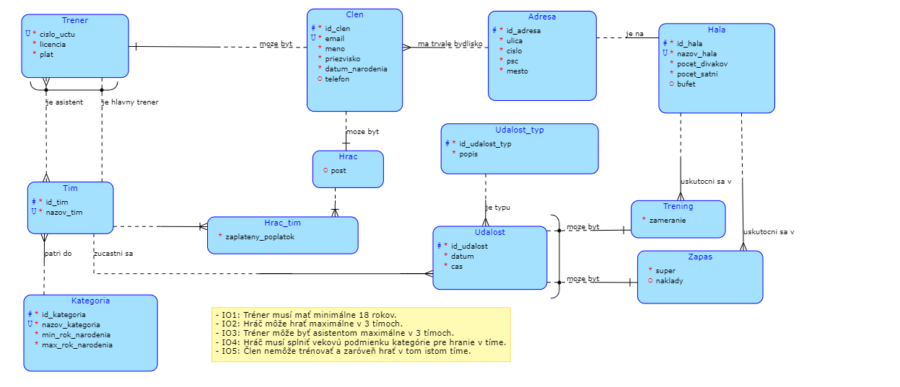

= Floorball Club Database

Floorball club database developed as my project for Database Systems course at link:https://fit.cvut.cz/cs[FIT CTU].

== Conceptual model

 

== Relational model

 

== Popis:

Florbalový klub má stovky *členov*, o ktorých potrebuje evidovať _meno_, _priezvisko_, _email_, _dátum narodenia_, prípadne aj _telefónne číslo_ a adresu. *Adresa* sa klasicky skladá z _ulice_, _čísla_, _PSČ_ a _mesta_. Členmi klubu sú hráči a tréneri a nie je vylúčenné, že dospelý člen môže byť zároveň hráčom aj trénerom.

O *hráčoch* je možné evidovať ich preferovanú pozíciu alebo _post_, no nie je to nutné. Hráč môže trénovať a hrať vo viacerých tímoch a je potrebné evidovať, či už _zaplatil_ za členstvo v danom tíme. Hráč môže hrať maximálne v troch tímoch. Pri *tréneroch* je najpotrebnejšie poznať ich _plat_ a unikátne _číslo účtu_ vo forme IBAN a v neposlednom rade aj ktoré tímy trénujú a akú najvyššiu _licenciu_ majú dosiahnutú. Je podstatné myslieť na to, že tréner môže byť buď hlavný tréner alebo asistent trénera daného tímu. Hlavným trénerom môže byť maximálne jedného tímu, asistentom v maximálne troch tímoch.

O každom *tíme* potrebujeme evidovať jeho unikátny _názov_. Každý tím patrí do určitej *vekovej kategórie*, to rozhoduje ako starí hráči môžu v danom tíme hrať. Pri každej vekovej kategórii je daný _minimálny_ a _maximálny rok narodenia_ hráčov súťažiacich v danej kategórii a jej unikátny _názov_.

Každý tím sa môže zúčastnovať *udalostí*. O každej udalosti klub potrebuje evidovať _dátum_ a _čas_ jej uskutočnenia. Udalosť je nejakého *typu*, o ktorom chceme evidovať iba _popis_, ktorý objasňuje o akú udalosť ide. Napríklad zápas, tréning, teambuilding (escape room, bowling), atp. Ponuka udalostí sa môže v budúcnosti rozširovať, keďže členovia tímov môžu prísť s vlastnými nápadmi.

Pri udalostiach typu *zápas* a *tréning* je potrebné evidovať ešte daľšie údaje. Pri zápasoch je potrebné poznať _súpera_, proti ktorému budeme hrať a prípadne aj _náklady_, napríklad na dopravu, ubytovanie, prenájom haly, atp., no nie je to vždy potrebné, napríklad v prípade individuálnej dopravy členov tímu na zápas vonku. O tréningu chceme evidovať jeho _zameranie_ (taktický, kondičný, hrací, …). Ďalej pri týchto dvoch športových udalostiach je nutné evidovať *halu*, v ktorej sa uskutočnia. Hala sa nachádza na nejakej adrese, má unikátny názov a ďalej chceme ešte evidovať _počet šatní_, _počet divákov_ a prípadne aj možnosť občerstvenia v _bufete_.

== IO:

* IO1: Tréner musí mať minimálne 18 rokov.

* IO2: Hráč môže hrať maximálne v 3 tímoch.

* IO3: Tréner môže byť asistentom maximálne v 3 tímoch.

* IO4: Hráč musí splniť vekovú podmienku kategórie pre hranie v tíme.

* IO5: Člen nemôže trénovať a zaróveň hrať v tom istom tíme.

== Dotazy:

. Tréneri (id_clen, meno, priezvisko, email, licencia), ktorí sú asistentom trénera *IBA* v tímoch kategórie U16.
 link:sql/01.sql[SQL]
. Tímy (id_tim, nazov_tim), ktoré sa zúčastnia *VŠETKÝCH* typov udalostí.
 link:sql/02.sql[SQL]
. Email, meno a priezvisko hráčov tímu Team U16 B, ktorí ešte nezaplatili členský poplatok.
 link:sql/03.sql[SQL]
. Vekové kategórie, v ktorých klub nemá ani jeden tím.
 link:sql/04.sql[SQL]
. Tréneri (id_clen, meno, priezvisko, email, licencia), ktorí majú plat väčší ako 20000.
 link:sql/05.sql[SQL]
. Haly, v ktorých sa neuskutoční žiadny zápas.
 link:sql/06.sql[SQL]
. Tréneri (email, meno, priezvisko), ktorí majú menej ako 25 rokov.
 link:sql/07.sql[SQL]
. Vypíš všetkých trénerov (meno, priezvisko, email, licencia) a počet tímov, v ktorých robia asistenta.
 link:sql/08.sql[SQL]
. Tréneri (id_clen, email, meno, priezvisko, licencia), ktorí nie su asistentami trénera v ani jednom tíme.
 link:sql/09.sql[SQL]
. Zoraď tímy podľa počtu hráčov zostupne (vypíš názov tímu a počet hráčov).
 link:sql/10.sql[SQL]
. Tréneri (meno, priezvisko, licencia, plat), ktorí majú väčší plat ako priemerný plat, zorad ich podľa najviac zarábajúceho.
 link:sql/11.sql[SQL]
. Tímy, ktoré sa zúčastnia zápasu aj tréningu.
link:sql/12.sql[SQL]
. Obrancovia A tímu spolu s brankármi A tímu (meno, priezvisko, post).
link:sql/13.sql[SQL]
. Vsetkym hlavnym trenerom zdvihni plat o 10% a zaokrúhli na najbližšiu 100 (teda 20110 = 20100).
link:sql/14.sql[SQL]
. Vymaž všetky udalosti typu bowling a escape room.
link:sql/15.sql[SQL]
. Náhodnému tímu pridaj náhodného asistenta.
link:sql/16.sql[SQL]
. Vytvor pohľad, ktorý bude zobrazovať iba skúsených hlavných trénerov (= tréner s licenciou C, ktorý je hlavným trénerom v nejakom tíme).
link:sql/17.sql[SQL]
. Tímy (názov tímu, meno a priezvisko hlavného trénera a názov vekovej kategórie), v ktorých je hlavným trénerom skúsený tréner.
link:sql/18.sql[SQL]
. Zoraď tímy s 2 alebo viac brankármi podľa počtu brankárov (vypíš názov tímu, meno a priezvisko hlavného trénera a počet brankárov).
link:sql/19.sql[SQL]
. Vyber všetkých trénerov (meno, priezivsko, licencia) a všetky tímy (názov, veková kategória) vrátane informácie, aký tím trénuje daný tréner ako hlavný tréner a kto je hlavným trénerom daného tímu. V prípade, že tím nemá hlavného trénera vypíš BEZ TRENERA a v prípade, že tréner nerobí hlavného trénera, vypíš NETRENUJE. Výstup zoraď podľa mena a priezivska trénera.
link:sql/20.sql[SQL]
. Adresy, na ktorých býva viac ako 1 člen, zoraď ich zostupne podľa počtu obyvateľov (členov, ktorí bývajú na danej adrese).
link:sql/21.sql[SQL]
. Zápasy (nazov_tim, super, datum, cas, naklady), ktoré sa uskutočnia v hale Stroman Sports.
link:sql/22.sql[SQL]
. Hracie tréningy (datum,cas,zameranie,id_hala) tímu Team U18.
link:sql/23.sql[SQL]
. Adresy hál (nazov_hala, ulica, cislo, psc, mesto), v ktorých je možnosť občerstvenia v bufete.
link:sql/24.sql[SQL]
. Emaily asistentov v tíme Team A.
link:sql/25.sql[SQL]
. Kontrola dotazu kategorie D.
link:sql/26.sql[SQL]

== Smyčky:

Schéma obsahuje viacero smyčiek.

. CLEN - TRENER - TIM - HRAC_TIM - HRAC +
Môže nastať situácia, že ten istý člen bude trénovať aj hrať v tom istom tíme, čo môže spôsobovať problémy, keďže väčšina profesionálnych súťaží toto nepovoluje, preto som zaviedol IO5.
. TIM - UDALOST - ZAPAS - HALA - ADRESA - CLEN - TRENER
. TIM - UDALOST - ZAPAS - HALA - ADRESA - CLEN - HRAC - HRAC_TIM
. TIM - UDALOST - TRENING - HALA - ADRESA - CLEN - TRENER
. TIM - UDALOST - TRENING - HALA - ADRESA - CLEN - HRAC - HRAC_TIM +
Posldené 4 smyčky si sú veľmi podobné, preto si ich dovolím okomentovať naraz. Tieto smyčky sú v poriadku a nepredstavujú riziko alebo potenciálne problémy s konzistenciou dát v databázi. Entita ADRESA je tzv. číselník, ktorú využívam na uloženie adresy trvalého bydliska členov klubu a športovej haly, v ktorej sa uskutoční zápas alebo tréning. Teoreticky môže nastať situácia, že člen bude bývať na rovnakej adrese, na akej sa nachádza športová hala, čo ale nepredstavuje žiadny problém, keďže takáto situácia môže nastať aj v reálnom živote a je teda korektná.

== Zdroje:

. link:https://courses.fit.cvut.cz/BI-DBS/[Course pages BI-DBS]
. link:https://www.postgresql.org/docs/current/[PostgreSQL documentation]
. link:https://users.fit.cvut.cz/~hunkajir/dbs2/main.xml[Vzorová semestrálna práca 1]
. link:https://users.fit.cvut.cz/~hunkajir/dbs/main.xml[Vzorová semestrálna práca 2]
. J. Pokorný, M.Valenta: Databázové systémy, Praha : Česká technika - nakladatelství ČVUT, 2020, ISBN: 978-80-01-06696-6
. link:https://www.mockaroo.com/[Random data generator Mockaroo]
. link:https://stackoverflow.com/a/41210389[Stack Overflow - round to the nearest 100]

Conceptual model created using link:https://dbs.fit.cvut.cz/[data modeller at dbs.fit.cvut.cz].

Relational model generated by link:https://www.jetbrains.com/datagrip/[DataGrip]
